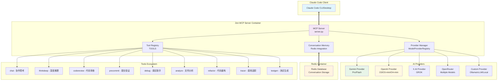
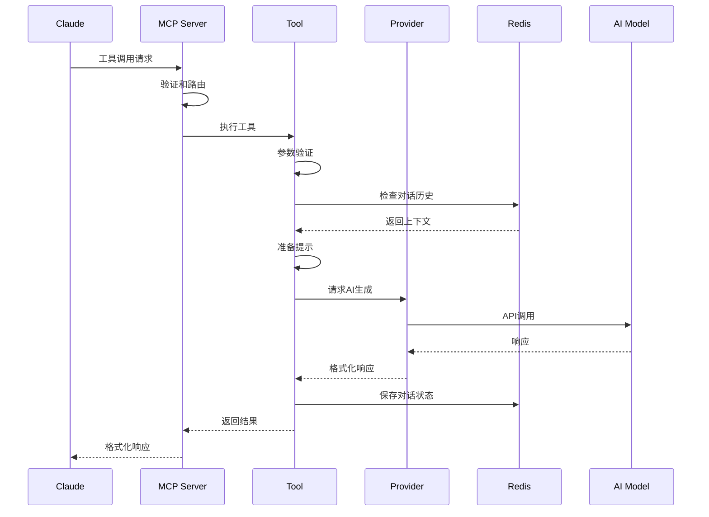
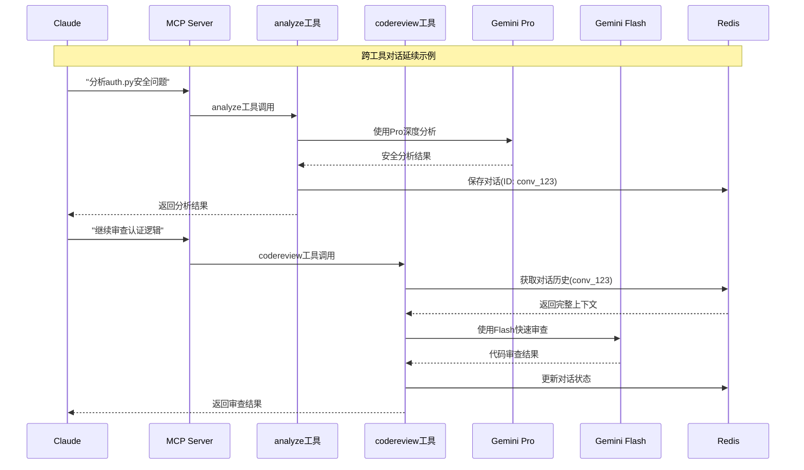
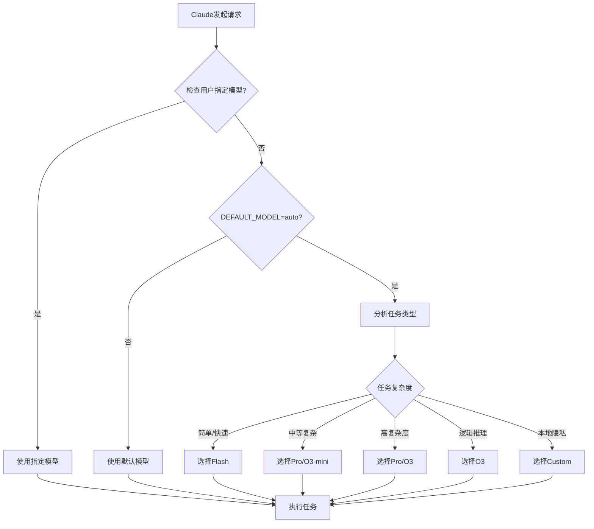

# Zen MCP Server 技术文档

> **完整的技术文档和架构指南**
> 版本：v4.7.5 | 更新日期：2025-06-16 | 作者：Fahad Gilani

## 📋 目录

1. [项目概述](#1-项目概述) - 目的、功能、特性、用户群体
2. [架构设计](#2-架构设计) - 整体架构、核心模块、数据流程
3. [技术栈](#3-技术栈) - 编程语言、框架、依赖项、环境要求
4. [安装和配置](#4-安装和配置) - 快速安装、API配置、环境设置
5. [使用指南](#5-使用指南) - 基本用法、工具示例、API文档
6. [开发指南](#6-开发指南) - 代码结构、开发环境、贡献指南
7. [故障排除](#7-故障排除) - 常见问题、调试方法、性能优化

## 🎯 快速导航

- **新手入门**: [安装和配置](#4-安装和配置) → [基本使用](#51-基本使用方法)
- **开发者**: [架构设计](#2-架构设计) → [开发指南](#6-开发指南)
- **运维人员**: [部署配置](#43-环境配置文件) → [监控日志](#74-监控和日志)
- **问题解决**: [故障排除](#7-故障排除) → [性能优化](#73-性能优化)

---

## 1. 项目概述

### 1.1 项目目的和功能

Zen MCP Server 是一个基于 Model Context Protocol (MCP) 的多模型AI协作服务器，旨在为 Claude 提供访问多种AI模型的能力，实现增强的代码分析、问题解决和协作开发。

**核心理念：** "One Context. Many Minds" - 一个上下文，多个AI大脑协作。

### 1.2 主要特性和能力

- **真正的AI编排**：Claude 可以在对话中自动在不同模型间切换
- **跨工具对话延续**：在不同工具间保持完整的对话上下文
- **多模型支持**：支持 Gemini、OpenAI O3、X.AI GROK、OpenRouter、本地模型等
- **智能模型选择**：自动模式下 Claude 为每个任务选择最佳模型
- **上下文复活**：即使在 Claude 上下文重置后也能恢复对话
- **大型提示处理**：自动绕过 MCP 的 25K token 限制
- **安全文件处理**：智能文件路径验证和访问控制

### 1.3 目标用户群体

- **开发者**：需要AI辅助进行代码审查、调试、重构的程序员
- **架构师**：需要多AI视角进行架构设计和技术决策的技术负责人
- **团队领导**：需要AI协助进行代码质量管控和最佳实践推广的技术管理者
- **AI研究者**：希望探索多模型协作和AI编排的研究人员

---

## 2. 架构设计

### 2.1 整体架构图



### 2.2 核心模块和职责

#### 2.2.1 MCP Server 核心 (`server.py`)
- **协议处理**：实现 MCP 协议的 JSON-RPC 通信
- **工具发现**：向客户端暴露可用工具列表
- **请求路由**：将工具调用路由到相应的处理器
- **对话管理**：管理多轮AI对话的生命周期

#### 2.2.2 工具系统 (`tools/`)
- **BaseTool**：所有工具的抽象基类，提供通用功能
- **专业工具**：9个专门化工具，每个针对特定开发任务
- **请求验证**：使用 Pydantic 进行参数验证
- **文件安全**：路径验证和访问控制

#### 2.2.3 提供商系统 (`providers/`)
- **统一接口**：抽象不同AI服务商的API差异
- **模型能力**：管理每个模型的能力和限制
- **智能路由**：根据任务需求选择最佳模型
- **错误处理**：统一的错误处理和重试机制

#### 2.2.4 对话内存 (`utils/conversation_memory.py`)
- **Redis集成**：持久化对话状态
- **上下文管理**：跨工具和会话的上下文保持
- **文件去重**：智能文件引用去重和优先级管理
- **过期管理**：自动清理过期对话

### 2.3 数据流和处理流程

#### 2.3.1 基本工具调用流程


#### 2.3.2 多模型协作流程


#### 2.3.3 智能模型选择机制


---

## 3. 技术栈

### 3.1 编程语言和框架

- **Python 3.9+**：主要开发语言
- **asyncio**：异步编程支持
- **MCP (Model Context Protocol)**：与 Claude 的通信协议
- **Pydantic 2.0+**：数据验证和序列化
- **Redis 5.0+**：对话状态持久化

### 3.2 AI模型和API

#### 支持的AI提供商：
- **Google Gemini**：2.5 Pro (深度推理) / 2.0 Flash (快速响应)
- **OpenAI**：O3, O3-mini, O4-mini, O4-mini-high
- **X.AI**：GROK-3, GROK-3-fast
- **OpenRouter**：统一访问多种模型
- **自定义端点**：Ollama, vLLM, LM Studio 等本地模型

### 3.3 依赖项详情

```python
# 核心依赖
mcp>=1.0.0                    # Model Context Protocol
google-genai>=1.19.0          # Google Gemini API
openai>=1.0.0                 # OpenAI API
pydantic>=2.0.0               # 数据验证
redis>=5.0.0                  # 对话状态存储

# 开发依赖
pytest>=7.4.0                 # 测试框架
pytest-asyncio>=0.21.0        # 异步测试支持
pytest-mock>=3.11.0           # Mock 支持
```

### 3.4 开发和运行环境要求

#### 系统要求：
- **操作系统**：Linux, macOS, Windows (WSL2)
- **Python**：3.9, 3.10, 3.11, 3.12, 3.13
- **Docker**：用于容器化部署
- **Git**：版本控制

#### 开发工具：
- **代码格式化**：Black (120字符行长度)
- **代码检查**：Ruff (现代Python linter)
- **导入排序**：isort
- **测试**：pytest + 361个单元测试

---

## 4. 安装和配置

### 4.1 快速安装 (Docker 方式)

#### 前置条件
```bash
# 确保已安装
- Docker Desktop
- Git
- 至少一个AI API密钥
```

#### 一键安装
```bash
# 克隆项目
git clone https://github.com/BeehiveInnovations/zen-mcp-server.git
cd zen-mcp-server

# 一键启动 (包含Redis)
./run-server.sh
```

### 4.2 API密钥配置

#### 选项A：OpenRouter (推荐)
```bash
# 访问 https://openrouter.ai/ 获取API密钥
export OPENROUTER_API_KEY="your-openrouter-key"
```

#### 选项B：原生API
```bash
# Gemini API (Google AI Studio)
export GEMINI_API_KEY="your-gemini-key"

# OpenAI API
export OPENAI_API_KEY="your-openai-key"

# X.AI API
export XAI_API_KEY="your-xai-key"
```

#### 选项C：本地模型
```bash
# Ollama 示例
export CUSTOM_API_URL="http://host.docker.internal:11434/v1"
export CUSTOM_API_KEY=""  # Ollama不需要密钥
export CUSTOM_MODEL_NAME="llama3.2"
```

### 4.3 环境配置文件

编辑 `.env` 文件：
```bash
# 模型配置
DEFAULT_MODEL=auto                    # 自动选择模型
DEFAULT_THINKING_MODE_THINKDEEP=high  # 默认思考深度

# 对话配置
CONVERSATION_TIMEOUT_HOURS=3          # 对话超时时间
MAX_CONVERSATION_TURNS=20             # 最大对话轮数

# 工作空间
WORKSPACE_ROOT=/Users/your-username   # 工作目录
USER_HOME=/Users/your-username        # 用户主目录

# 日志级别
LOG_LEVEL=DEBUG                       # 日志详细程度
```

### 4.4 Claude Desktop 配置

编辑 `claude_desktop_config.json`：
```json
{
  "mcpServers": {
    "zen": {
      "command": "docker",
      "args": [
        "exec",
        "-i", 
        "zen-mcp-server",
        "python",
        "server.py"
      ]
    }
  }
}
```

---

## 5. 使用指南

### 5.1 基本使用方法

#### 自然语言调用
```
# Claude 自动选择模型和工具
"用 zen 分析这个文件的架构设计"
"使用 zen 进行代码审查，重点关注安全问题"
"让 zen 帮我调试这个测试失败的问题"
```

#### 指定模型调用
```
# 使用特定模型
"用 flash 快速检查代码格式"
"使用 o3 调试这个逻辑错误"
"让 pro 深度思考这个架构决策"
```

### 5.2 工具使用示例

#### 5.2.1 chat - 协作思考
```
使用 zen 和我讨论 Redis vs Memcached 的选择，
分析我的项目需求，给出最终建议
```

#### 5.2.2 thinkdeep - 深度推理  
```
用 pro 深度思考我的认证设计，使用 max 思考模式，
头脑风暴出最佳架构方案
```

#### 5.2.3 codereview - 代码审查
```
使用 gemini pro 审查 auth.py 的安全问题，
需要可执行的计划，分解为快速实现的小步骤
```

### 5.3 高级功能

#### 5.3.1 跨工具对话延续
```
1. "分析 /src/auth.py 的安全问题"     → analyze 工具
2. "继续审查认证逻辑"                → codereview 工具 (保持上下文)
3. "调试认证测试失败"                → debug 工具 (保持完整历史)
```

#### 5.3.2 多模型协作
```
"首先用 local-llama 做快速本地分析，
然后用 opus 做全面安全审查"
```

### 5.4 完整工具API文档

#### 5.4.1 chat - 协作思考工具
**用途**：与AI进行协作思考、头脑风暴、获得第二意见

**参数：**
```json
{
  "prompt": "string (必需) - 讨论的问题或话题",
  "files": ["string"] (可选) - 上下文文件路径列表,
  "model": "string (可选) - 指定模型 (auto/pro/flash/o3等)",
  "temperature": "number (可选) - 创造性 (0-1, 默认0.5)",
  "thinking_mode": "string (可选) - 思考深度",
  "use_websearch": "boolean (可选) - 启用搜索建议 (默认true)"
}
```

**示例调用：**
```
"用zen聊聊Redis vs Memcached的选择，分析我的项目需求"
```

#### 5.4.2 thinkdeep - 深度推理工具
**用途**：获得AI的深度思考和扩展推理，挑战假设

**参数：**
```json
{
  "prompt": "string (必需) - 需要深度思考的问题",
  "files": ["string"] (可选) - 相关文件,
  "thinking_mode": "string (可选) - high/max推荐",
  "model": "string (可选) - pro/o3推荐深度推理"
}
```

#### 5.4.3 codereview - 代码审查工具
**用途**：专业代码审查，按严重程度分类问题

**参数：**
```json
{
  "files": ["string"] (必需) - 要审查的文件路径,
  "review_type": "string (可选) - full/security/performance/quick",
  "severity_filter": "string (可选) - critical/high/medium/low",
  "original_request": "string (可选) - 原始需求上下文"
}
```

#### 5.4.4 precommit - 提交前验证工具
**用途**：验证Git更改，确保符合要求

**参数：**
```json
{
  "path": "string (可选) - 搜索起始目录",
  "original_request": "string (可选) - 原始需求",
  "compare_to": "string (可选) - 比较的分支/标签",
  "review_type": "string (可选) - full/security/performance",
  "max_depth": "number (可选) - 搜索深度"
}
```

#### 5.4.5 debug - 调试助手工具
**用途**：根因分析和系统化调试

**参数：**
```json
{
  "issue_description": "string (必需) - 问题描述",
  "error_context": "string (可选) - 错误上下文/堆栈跟踪",
  "files": ["string"] (可选) - 相关文件",
  "runtime_info": "string (可选) - 运行时信息"
}
```

#### 5.4.6 analyze - 文件分析工具
**用途**：通用文件和代码分析

**参数：**
```json
{
  "files": ["string"] (必需) - 要分析的文件/目录,
  "prompt": "string (必需) - 分析要求",
  "analysis_type": "string (可选) - architecture/performance/security/quality",
  "output_format": "string (可选) - summary/detailed/actionable"
}
```

#### 5.4.7 refactor - 代码重构工具
**用途**：智能代码重构建议

**参数：**
```json
{
  "files": ["string"] (必需) - 要重构的文件,
  "refactor_type": "string (可选) - codesmells/decompose/modernize/organization",
  "language": "string (可选) - 编程语言",
  "style_guide": "string (可选) - 代码风格指南"
}
```

#### 5.4.8 tracer - 调用追踪工具
**用途**：生成静态代码分析提示

**参数：**
```json
{
  "target": "string (必需) - 要追踪的方法/类",
  "files": ["string"] (必需) - 相关文件,
  "analysis_mode": "string (可选) - precision/dependencies"
}
```

#### 5.4.9 testgen - 测试生成工具
**用途**：生成全面的测试套件

**参数：**
```json
{
  "files": ["string"] (必需) - 要测试的代码文件,
  "test_files": ["string"] (可选) - 现有测试文件作为模式,
  "focus": "string (可选) - 测试重点"
}
```

#### 通用参数说明

**模型选择 (`model`)：**
- `auto`: Claude自动选择最佳模型
- `pro`: Gemini 2.5 Pro (深度分析)
- `flash`: Gemini 2.0 Flash (快速响应)
- `o3`: OpenAI O3 (逻辑推理)
- `o3-mini`: OpenAI O3-mini (平衡性能)
- `grok`: X.AI GROK-3 (高级推理)
- 自定义模型名称

**思考模式 (`thinking_mode`)：**
- `minimal`: 0.5% 模型最大token (超快)
- `low`: 8% 模型最大token (快速)
- `medium`: 33% 模型最大token (标准)
- `high`: 67% 模型最大token (深度)
- `max`: 100% 模型最大token (最深度)

**文件处理：**
- 所有文件路径必须是绝对路径
- 支持目录递归扫描
- 自动检测和处理 `prompt.txt` 文件
- 智能token管理和文件截断

---

## 6. 开发指南

### 6.1 代码结构和组织

```
zen-mcp-server/
├── server.py              # MCP服务器主入口
├── config.py              # 配置和常量
├── tools/                 # 工具实现
│   ├── __init__.py
│   ├── base.py           # 工具基类
│   ├── chat.py           # 聊天工具
│   ├── analyze.py        # 分析工具
│   └── ...
├── providers/            # AI提供商
│   ├── __init__.py
│   ├── base.py          # 提供商基类
│   ├── gemini.py        # Gemini提供商
│   └── ...
├── systemprompts/       # 系统提示
├── utils/               # 工具函数
├── tests/               # 单元测试
├── simulator_tests/     # 集成测试
└── docs/               # 文档
```

### 6.2 开发环境搭建

#### 1. 创建虚拟环境
```bash
python -m venv venv
source venv/bin/activate  # Windows: venv\Scripts\activate
pip install -r requirements.txt
```

#### 2. 代码质量检查
```bash
# 运行完整质量检查
./code_quality_checks.sh

# 单独运行检查
ruff check --fix          # 代码检查和自动修复
black .                   # 代码格式化
isort .                   # 导入排序
pytest tests/ -v          # 运行测试
```

#### 3. 启动开发服务器
```bash
./run-server.sh           # 启动Docker容器
./run-server.sh -f        # 启动并跟踪日志
```

### 6.3 添加新工具

#### 步骤1：创建工具文件
```python
# tools/example.py
from .base import BaseTool, ToolRequest
from pydantic import Field

class ExampleRequest(ToolRequest):
    prompt: str = Field(..., description="用户输入")
    
class ExampleTool(BaseTool):
    def get_name(self) -> str:
        return "example"
        
    def get_description(self) -> str:
        return "示例工具描述"
        
    # 实现其他抽象方法...
```

#### 步骤2：注册工具
```python
# server.py
TOOLS = {
    # ... 现有工具
    "example": ExampleTool(),
}
```

#### 步骤3：编写测试
```python
# tests/test_example.py
def test_example_tool():
    tool = ExampleTool()
    # 测试逻辑...
```

### 6.4 贡献指南和编码规范

#### 代码规范
- **行长度**：120字符
- **格式化**：使用 Black
- **导入**：使用 isort 排序
- **类型提示**：必须使用类型注解
- **文档字符串**：使用 Google 风格

#### 提交流程
1. Fork 项目并创建功能分支
2. 运行 `./code_quality_checks.sh` 确保代码质量
3. 运行完整测试套件
4. 提交 Pull Request
5. 等待代码审查和合并

#### 测试要求
- **单元测试覆盖率**：>90%
- **集成测试**：所有工具必须通过模拟器测试
- **性能测试**：关键路径需要性能基准

---

## 7. 故障排除

### 7.1 常见问题和解决方案

#### 问题1：容器启动失败
```bash
# 症状：Docker容器无法启动
# 解决方案：
docker stop zen-mcp-server zen-mcp-redis
docker rm zen-mcp-server zen-mcp-redis
./run-server.sh

# 检查日志
docker logs zen-mcp-server
```

#### 问题2：API密钥无效
```bash
# 症状：认证失败错误
# 解决方案：
# 1. 检查.env文件中的API密钥
cat .env | grep API_KEY

# 2. 验证密钥有效性
curl -H "Authorization: Bearer $GEMINI_API_KEY" \
     https://generativelanguage.googleapis.com/v1beta/models
```

#### 问题3：工具调用超时
```bash
# 症状：工具执行超时
# 解决方案：
# 1. 检查模型负载
# 2. 增加超时时间
# 3. 使用更快的模型 (如 flash)
```

### 7.2 调试方法和工具

#### 日志分析
```bash
# 实时查看服务器日志
docker exec zen-mcp-server tail -f /tmp/mcp_server.log

# 查看Redis连接状态
docker exec zen-mcp-redis redis-cli ping

# 检查容器资源使用
docker stats zen-mcp-server
```

#### 测试调试
```bash
# 运行单个测试
python -m pytest tests/test_chat.py::TestChatTool::test_basic_chat -v

# 运行模拟器测试
python communication_simulator_test.py --individual test_basic_conversation

# 保持日志用于调试
python communication_simulator_test.py --keep-logs
```

### 7.3 性能优化

#### 内存优化
- 使用 Redis LRU 策略自动清理旧对话
- 文件内容智能截断避免超出token限制
- 对话去重减少重复数据传输

#### 响应速度优化
- 自动模式下优先选择快速模型
- 文件路径而非内容传输减少网络开销
- 异步处理提高并发性能

### 7.4 监控和日志

#### 日志级别配置
```bash
# 设置日志级别
export LOG_LEVEL=DEBUG    # 详细调试信息
export LOG_LEVEL=INFO     # 一般信息
export LOG_LEVEL=WARNING  # 仅警告和错误
```

#### 关键监控指标
```bash
# 容器健康状态
docker ps --filter name=zen-mcp

# 内存使用情况
docker stats zen-mcp-server --no-stream

# Redis连接状态
docker exec zen-mcp-redis redis-cli info replication

# 日志实时监控
docker exec zen-mcp-server tail -f /tmp/mcp_server.log
```

#### 性能基准测试
```bash
# 运行性能测试
python communication_simulator_test.py --benchmark

# 测试特定工具性能
python -m pytest tests/test_performance.py -v

# 内存泄漏检测
python -m pytest tests/ --memray
```

---

## 附录

### A. 配置参考

#### 环境变量完整列表
```bash
# API配置
GEMINI_API_KEY=                    # Google Gemini API密钥
OPENAI_API_KEY=                    # OpenAI API密钥  
XAI_API_KEY=                       # X.AI API密钥
OPENROUTER_API_KEY=                # OpenRouter API密钥
CUSTOM_API_URL=                    # 自定义API端点
CUSTOM_API_KEY=                    # 自定义API密钥
CUSTOM_MODEL_NAME=                 # 自定义模型名称

# 模型配置
DEFAULT_MODEL=auto                 # 默认模型选择
DEFAULT_THINKING_MODE_THINKDEEP=high  # 默认思考模式

# 对话配置  
CONVERSATION_TIMEOUT_HOURS=3       # 对话超时小时数
MAX_CONVERSATION_TURNS=20          # 最大对话轮数

# 系统配置
WORKSPACE_ROOT=                    # 工作空间根目录
USER_HOME=                         # 用户主目录
LOG_LEVEL=DEBUG                    # 日志级别
REDIS_URL=redis://redis:6379/0     # Redis连接URL
```

### B. 模型能力对比

| 模型 | 上下文窗口 | 特点 | 适用场景 |
|------|------------|------|----------|
| Gemini 2.5 Pro | 1M tokens | 深度推理+思考模式 | 复杂架构、深度分析 |
| Gemini 2.0 Flash | 1M tokens | 超快响应 | 快速分析、简单查询 |
| OpenAI O3 | 200K tokens | 强逻辑推理 | 逻辑问题、代码生成 |
| OpenAI O3-mini | 200K tokens | 平衡性能/速度 | 中等复杂度任务 |
| GROK-3 | 131K tokens | 高级推理 | 复杂分析 |

### C. 版本历史

- **v4.7.5** (2025-06-16): 当前版本，完整多模型支持
- **v4.x**: 添加 OpenRouter 和自定义端点支持
- **v3.x**: 引入对话延续和上下文复活
- **v2.x**: 多工具协作和Redis集成
- **v1.x**: 基础MCP服务器和Gemini集成

### D. 实际使用案例

#### 案例1：复杂架构设计
```
用户: "设计一个高并发的用户认证系统"

1. Claude: "我来协调多个AI模型来设计这个系统"
2. 使用 thinkdeep + pro: 深度思考架构方案
3. 使用 chat + o3: 验证技术选型
4. 使用 analyze + flash: 快速分析现有代码
5. Claude综合所有建议给出最终方案
```

#### 案例2：代码质量提升
```
工作流程:
1. analyze工具 + pro: 分析整个代码库架构
2. codereview工具 + flash: 快速发现代码问题
3. refactor工具 + pro: 生成重构建议
4. testgen工具 + o3: 生成测试用例
5. precommit工具 + flash: 验证所有更改
```

#### 案例3：调试复杂问题
```
调试流程:
1. debug工具 + o3: 逻辑分析和假设生成
2. analyze工具 + pro: 深度代码分析
3. chat工具 + flash: 快速验证修复方案
4. testgen工具 + o3: 生成回归测试
```

### E. 最佳实践总结

#### 模型选择策略
- **快速任务**: 使用 flash (格式检查、简单分析)
- **复杂分析**: 使用 pro (架构设计、深度审查)
- **逻辑推理**: 使用 o3 (调试、算法分析)
- **本地隐私**: 使用 custom (敏感代码分析)

#### 工具组合模式
- **分析→审查→重构**: 完整代码改进流程
- **思考→聊天→调试**: 问题解决流程
- **分析→测试→提交**: 开发验证流程

#### 性能优化技巧
- 使用文件路径而非内容减少传输
- 合理设置thinking_mode平衡质量和速度
- 利用对话延续避免重复上下文传输
- 自动模式让Claude选择最优模型

---

*本文档最后更新：2025-06-16*
*版本：v4.7.5*
*作者：Fahad Gilani*

*这是一份活文档，会随着项目发展持续更新。如有问题或建议，请提交Issue或Pull Request。*
