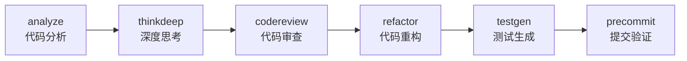
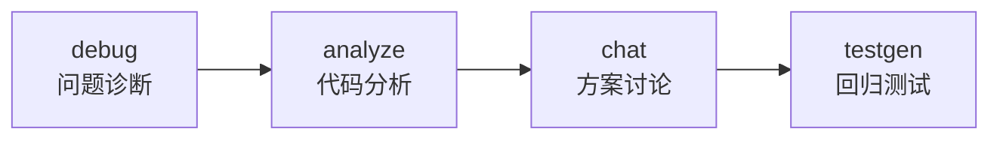

# Zen MCP Server 技术概览

> **快速技术参考和架构总览**

## 🏗️ 核心架构

```
Claude Code ←→ MCP Server ←→ AI Providers (Gemini/OpenAI/GROK/Custom)
                    ↓
               Redis (对话存储)
```

## 🛠️ 技术栈总览

| 组件 | 技术 | 版本 | 用途 |
|------|------|------|------|
| **核心语言** | Python | 3.9+ | 主要开发语言 |
| **通信协议** | MCP | 1.0+ | 与Claude通信 |
| **数据验证** | Pydantic | 2.0+ | 参数验证和序列化 |
| **对话存储** | Redis | 5.0+ | 持久化对话状态 |
| **容器化** | Docker | Latest | 部署和隔离 |
| **AI模型** | Multi-Provider | - | Gemini/OpenAI/GROK等 |

## 🔧 9大核心工具

| 工具 | 功能 | 推荐模型 | 使用场景 |
|------|------|----------|----------|
| **chat** | 协作思考 | pro/flash | 头脑风暴、技术讨论 |
| **thinkdeep** | 深度推理 | pro/o3 | 复杂问题、架构设计 |
| **codereview** | 代码审查 | pro/flash | 代码质量、安全审查 |
| **precommit** | 提交验证 | pro/flash | Git提交前检查 |
| **debug** | 调试助手 | o3/pro | 问题诊断、根因分析 |
| **analyze** | 文件分析 | flash/pro | 代码理解、架构分析 |
| **refactor** | 代码重构 | pro | 代码改进、结构优化 |
| **tracer** | 调用追踪 | flash | 静态分析、依赖映射 |
| **testgen** | 测试生成 | o3/pro | 测试用例、边界测试 |

## 🤖 AI模型能力对比

| 模型 | 上下文 | 特点 | 最佳用途 | 成本 |
|------|--------|------|----------|------|
| **Gemini Pro** | 1M | 深度推理+思考模式 | 复杂架构、深度分析 | 中等 |
| **Gemini Flash** | 1M | 超快响应 | 快速分析、简单查询 | 低 |
| **OpenAI O3** | 200K | 强逻辑推理 | 逻辑问题、代码生成 | 高 |
| **OpenAI O3-mini** | 200K | 平衡性能/速度 | 中等复杂度任务 | 中等 |
| **GROK-3** | 131K | 高级推理 | 复杂分析 | 中等 |
| **Custom/Local** | 变化 | 本地隐私 | 敏感代码、成本控制 | 极低 |

## 🚀 快速开始

### 1分钟安装
```bash
git clone https://github.com/BeehiveInnovations/zen-mcp-server.git
cd zen-mcp-server
./run-server.sh
```

### 配置API密钥
```bash
# 编辑 .env 文件
GEMINI_API_KEY=your-key
OPENAI_API_KEY=your-key
DEFAULT_MODEL=auto
```

### 基本使用
```
"用zen分析这个文件"           # 自动选择模型
"使用flash快速检查代码格式"    # 指定快速模型
"让pro深度思考架构设计"       # 指定深度模型
```

## 🔄 核心工作流程

### 典型开发流程


### 调试流程


## 📊 关键特性

### ✨ 独特优势
- **真正的AI编排**: Claude自动协调多个AI模型
- **对话延续**: 跨工具保持完整上下文
- **智能模型选择**: 自动为任务选择最佳模型
- **上下文复活**: 即使Claude重置也能恢复对话
- **大型提示处理**: 自动绕过MCP 25K限制

### 🛡️ 安全特性
- 文件路径安全验证
- 只读工作空间挂载
- API密钥环境隔离
- 容器化安全边界

### ⚡ 性能特性
- Redis LRU自动清理
- 智能文件去重
- 异步处理支持
- 文件路径传输优化

## 🔧 开发配置

### 代码质量工具
```bash
./code_quality_checks.sh    # 一键质量检查
ruff check --fix           # 代码检查修复
black .                    # 代码格式化
pytest tests/ -v           # 运行测试
```

### 容器管理
```bash
./run-server.sh            # 启动服务
./run-server.sh -f         # 启动并跟踪日志
docker logs zen-mcp-server # 查看日志
docker stats zen-mcp-server # 监控资源
```

## 📈 监控和调试

### 关键指标
- **容器状态**: `docker ps --filter name=zen-mcp`
- **内存使用**: `docker stats zen-mcp-server --no-stream`
- **Redis状态**: `docker exec zen-mcp-redis redis-cli ping`
- **实时日志**: `docker exec zen-mcp-server tail -f /tmp/mcp_server.log`

### 常见问题快速解决
```bash
# 容器重启
docker stop zen-mcp-server zen-mcp-redis && ./run-server.sh

# 清理重建
docker rm -f zen-mcp-server zen-mcp-redis && ./run-server.sh

# 检查API密钥
cat .env | grep API_KEY
```

## 🎯 最佳实践

### 模型选择策略
- **快速任务** → flash (格式检查、简单分析)
- **复杂分析** → pro (架构设计、深度审查)  
- **逻辑推理** → o3 (调试、算法分析)
- **本地隐私** → custom (敏感代码分析)

### 工具组合模式
- **分析→审查→重构**: 完整代码改进
- **思考→聊天→调试**: 问题解决
- **分析→测试→提交**: 开发验证

### 性能优化
- 使用文件路径而非内容传输
- 合理设置thinking_mode平衡质量和速度
- 利用对话延续避免重复上下文
- 自动模式让Claude选择最优模型

## 📚 相关文档

- **[完整技术文档](TECHNICAL_DOCUMENTATION.md)** - 详细架构和开发指南
- **[README.md](../README.md)** - 项目介绍和快速开始
- **[故障排除指南](troubleshooting.md)** - 常见问题解决
- **[高级用法](advanced-usage.md)** - 高级功能和配置
- **[贡献指南](contributions.md)** - 开发和贡献流程

---

*这是一份快速参考文档。如需详细信息，请查看 [完整技术文档](TECHNICAL_DOCUMENTATION.md)。*
